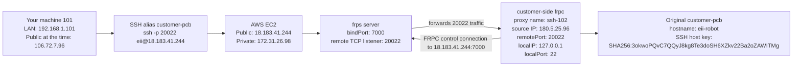
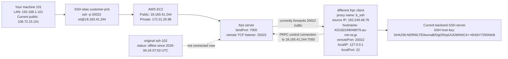
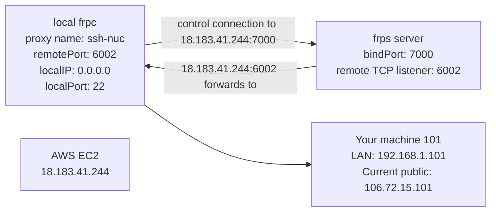

# customer-pcb FRP Incident Notes - 2026-06-30

## Context

`customer-pcb` is configured locally as an SSH alias for:

```sshconfig
Host customer-pcb
  HostName 18.183.41.244
  Port 20022
  User eii
```

This means:

```bash
ssh customer-pcb
```

expands to:

```bash
ssh -p 20022 eii@18.183.41.244
```

The EC2 host `18.183.41.244` runs `frps`. The customer machine reaches it through `frpc`, exposing SSH on EC2 remote port `20022`.

## Current Symptom

On 2026-06-30, `ssh customer-pcb` no longer logs in to the expected customer machine.

The SSH host key seen on `18.183.41.244:20022` changed to:

```text
ED25519 SHA256:NDRWLTE0wvnaB/DgGRopUUGWhhIC4++6hSkY7ZMXkh8
```

The previous known customer-machine host key was:

```text
ED25519 SHA256:3okwoPQvC7QQyJ8kg8Te3doSH6XZkv22Ba2oZAWITMg
```

This indicates that EC2 port `20022` is currently forwarding to a different SSH server than before.

## EC2 frps Status

Checked on EC2 via:

```bash
ssh ec2
```

Findings:

```text
/etc/frp/frps.toml mtime: 2026-02-27
/etc/systemd/system/frps.service mtime: 2026-01-29
/usr/local/bin/frps mtime: 2026-01-29
frps active since: 2026-02-27
frps version: 0.66.0
```

No evidence was found that the EC2 `frps` server config was modified recently.

Current online FRP proxy state from the EC2 dashboard/API:

```text
b_ssh    online   remotePort=20022   lastStartTime=06-30 00:18:15   clientVersion=0.66.0
ssh-102  offline  lastStartTime=06-26 05:00:55   lastCloseTime=06-26 07:53:58
```

## Important Timeline

### 2026-06-26: customer-pcb still worked

Codex history shows `ssh customer-pcb` succeeded on 2026-06-26 10:28 JST.

The remote command returned:

```text
Fri Jun 26 10:28:48 AM JST 2026
eii-robot
```

At that exact time, EC2 `frps` logs show the connection entered proxy `ssh-102`, not `b_ssh`:

```text
2026-06-26 01:28:47 UTC [ssh-102] get a user connection [106.72.7.96:...]
```

So when `customer-pcb` worked, EC2 port `20022` was being served by `ssh-102`.

### 2026-06-26 07:53 UTC: ssh-102 went offline

EC2 `frps` logs:

```text
2026-06-26 07:53:58 UTC [ssh-102] proxy closing
```

After this, `ssh-102` did not come back online in the retained logs.

### 2026-06-30 00:18 UTC: b_ssh took port 20022

EC2 `frps` logs:

```text
2026-06-30 00:18:15 UTC client login ip [182.249.48.79:53050] version [0.66.0]
2026-06-30 00:18:15 UTC [b_ssh] tcp proxy listen port [20022]
2026-06-30 00:18:15 UTC new proxy [b_ssh] type [tcp] success
```

From that point, `18.183.41.244:20022` was served by `b_ssh`.

## Current b_ssh Source IP

Current `b_ssh` client IP:

```text
182.249.48.79
hostname: KD182249048079.au-net.ne.jp
org: AS2516 KDDI CORPORATION
location: Tokyo, Japan
```

This looks like a KDDI/au Japanese dynamic network address. It could be a phone hotspot, mobile router, or consumer/mobile broadband. It is not the current local machine's public IP.

The local machine public IP observed during the investigation was:

```text
106.72.15.101
hostname: M106072015101.v4.enabler.ne.jp
org: AS2516 KDDI CORPORATION
```

The earlier successful `ssh-102` customer connection had source:

```text
180.5.25.96
hostname: p4400096-ipxg13801souka.saitama.ocn.ne.jp
org: AS4713 NTT DOCOMO BUSINESS,Inc.
```

## Working Hypothesis

The EC2 `frps` server was probably not modified.

The more likely explanation is:

1. The original customer-side FRPC proxy was `ssh-102` on `remotePort=20022`.
2. `ssh-102` went offline on 2026-06-26 07:53 UTC.
3. A different FRPC client later registered proxy `b_ssh` on the same `remotePort=20022`.
4. `customer-pcb` now reaches this different `b_ssh` backend, whose SSH host key and login credentials do not match the original customer machine.

## What To Ask The Engineer

Ask whether anyone changed or restarted an FRPC client around:

```text
2026-06-30 00:18 UTC
2026-06-30 09:18 JST
```

Specifically ask whether they configured a proxy like:

```toml
[[proxies]]
name = "b_ssh"
type = "tcp"
localIP = "127.0.0.1"
localPort = 22
remotePort = 20022
```

Also ask whether the original customer machine had a proxy like:

```toml
[[proxies]]
name = "ssh-102"
type = "tcp"
localIP = "127.0.0.1"
localPort = 22
remotePort = 20022
```

Do not overwrite EC2 `frps` config to fix this. The safer recovery path is to first bring the original customer machine back on a temporary unused port such as `20023`, verify the SSH host key matches:

```text
ED25519 SHA256:3okwoPQvC7QQyJ8kg8Te3doSH6XZkv22Ba2oZAWITMg
```

and only then decide whether to move the production alias back to `20022`.

## Relationship Diagram

### 2026-06-26 Working Path

At the time `ssh customer-pcb` still worked, EC2 port `20022` was served by proxy `ssh-102`.



### 2026-06-30 Current Broken Path

Currently EC2 port `20022` is served by proxy `b_ssh`, not `ssh-102`.



### Current Local Machine FRPC

This is separate from `customer-pcb`. It exposes your machine 101 to EC2 on `remotePort=6002`.


