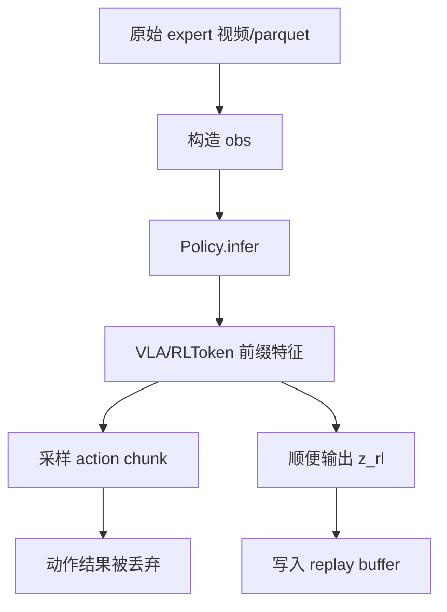
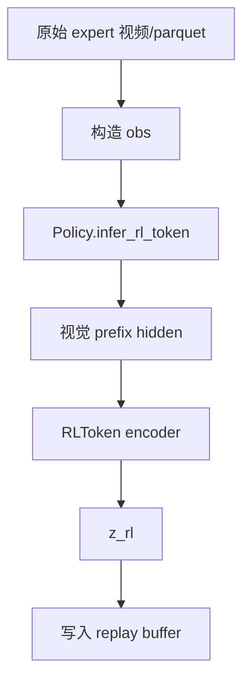

# RLToken 重新编码：为什么 z-only 路径更干净

日期：2026-07-03

## 一句话结论

旧的 `human_expert_no_actor_q_lower_right_4layer_20260701` 不是明显错数据，因为它确实使用了正确的 lower+right 4-layer checkpoint，也生成了 2048 维 `z_rl`。

但它的生成路径不够干净：它通过 `Policy.infer()` 间接拿 `z_rl`，而 `Policy.infer()` 的主要职责是“推理动作”。新版本改为 `Policy.infer_rl_token()`，只编码视觉/状态得到 `z_rl`，不采样动作，因此更适合作为 replay buffer 的固定表征。

## 具体例子

假设有同一帧人类演示：

```text
cam_low 图像
cam_right_wrist 图像
robot state
```

我们只想得到：

```text
z_rl = RLToken(cam_low, cam_right_wrist, state)
```

也就是把这一帧状态编码成 critic/actor 训练用的状态表征。

## 旧路径

旧路径调用的是：

```text
Policy.infer(obs)
```

它的语义更接近：

```text
给我当前 obs，推理下一段 action，同时顺便返回 z_rl
```

流程如下：



问题不在于 checkpoint 错了，而在于这条路径做了多余的动作采样。

对于 replay buffer 重新编码来说，动作采样是不必要的，因为 expert replay 里的动作已经来自人类演示 parquet，不需要 VLA 再生成动作。

## 新路径

新路径调用的是：

```text
Policy.infer_rl_token(obs)
```

它的语义是：

```text
只把当前 obs 编码成 z_rl，不生成 action
```

流程如下：



这条路径更直接，少了“采样 action chunk 后再丢掉”的环节。

## 数字例子

假设某一帧的真实人类动作是：

```text
human_action = [0.10, -0.02, 0.03, ...]
```

训练 critic 时，我们希望保存：

```text
state 表征: z_rl
action: human_action
reference_action: human_action
reward: 1
```

旧路径实际做了：

```text
z_rl = Policy.infer(obs) 里的附带输出
sampled_action = Policy.infer(obs) 生成的动作，但不用
action = human_action
reference_action = human_action
```

新路径做的是：

```text
z_rl = Policy.infer_rl_token(obs)
action = human_action
reference_action = human_action
```

所以新路径的语义更一致：所有 replay 中的动作都来自人类演示，`z_rl` 只负责描述当前状态。

## 为什么旧数据“不算错”

旧数据有这些正面证据：

- 59 个 shard 都存在。
- `z_rl` / `next_z_rl` 都是 2048 维。
- manifest 指向正确 checkpoint：
  `rlt_lower_right_rl_token_ablation_20260701/BEST/checkpoint`
- manifest 指向正确 config：
  `eii_rinse_11repo_cam4_fullft_rl_token_lower_right_query_4layer`
- `action == reference_action`，符合 human expert no-actor 数据语义。

所以它不是“用了 cam3 / 512 / 错 checkpoint”的那种错误。

## 为什么新数据更推荐

新数据更推荐，是因为它满足更严格的数据语义：

```text
expert replay = 人类动作 + 固定状态表征 + 人工成功 reward
```

其中：

- 人类动作来自 LeRobot parquet。
- 视频来自原始 LeRobot mp4。
- `z_rl` 来自 lower+right 4-layer RLToken encoder。
- 不经过 action sampling。

这让 critic 学到的关系更清楚：

```text
Q(z_rl, human_action) -> success
```

而不是在数据生成过程中混入一个虽然被丢弃、但不必要的 VLA action sampling 步骤。

## 另一个重要发现：z_rl 不是 bit-exact

我做了重复实验：同一个 episode，用同一个 checkpoint、同一个 obs，独立进程重新编码两次，`z_rl` 不是逐 bit 完全一致。

现象：

```text
max_abs_diff ≈ 0.398
mean_abs_diff ≈ 0.030
```

但同时：

```text
frame_index 完全一致
action 完全一致
reference_action 完全一致
proprio 完全一致
reward 完全一致
```

这说明差异主要来自 GPU/JAX/bfloat16 执行的数值非确定性，而不是裁剪错位或动作错位。

因此后续训练应该固定使用已经落盘的一版 `z_rl`，不要每次训练前重新生成一遍。

## 推荐使用的数据

推荐使用最新 z-only 版本：

```text
/home/eii/data/openpi0.5-rtc-reward-learning/replay/human_expert_no_actor_q_lower_right_4layer_from_raw_zonly_20260703
```

对应 manifest：

```text
/home/eii/project/openpi0.5-rtc-reward-learning/local_rlt_manifests/expert_from_raw_20260703/human_expert_no_actor_q_lower_right_4layer_from_raw_zonly_20260703.jsonl
```

旧版本：

```text
/home/eii/data/openpi0.5-rtc-reward-learning/replay/human_expert_no_actor_q_lower_right_4layer_20260701
```

可以作为参考或 ablation，但不建议作为下一轮主训练入口。
